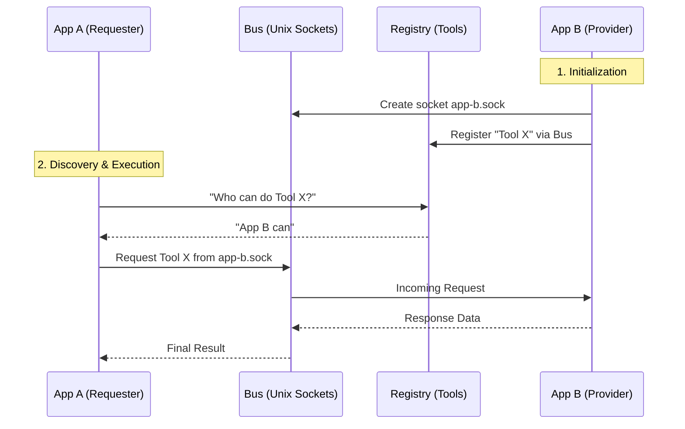

# PulseFlake 💕

<p align="center">
  
  
  
  
</p>

**PulseFlake** (formerly **FuckingLonely**) is a decentralized, **Event-Driven Reactive AI** ecosystem. It bridges **Multi-Modal Large Language Models (MLLM)** with real-world applications through a high-performance **Unix Socket IPC** layer.

By decoupling the AI "brain" from its "sensors" and "tools," PulseFlake enables modular, scalable, and highly reactive autonomous agents that can process multi-modal events and orchestrate complex tool-driven workflows.

---

## 📋 Table of Contents

- [Why PulseFlake?](#-why-pulseflake)
- [Technical Architecture](#-technical-architecture)
- [Architecture Overview](#-architecture-overview)
- [Current Apps](#-current-apps)
- [Project Structure](#-project-structure)
- [Multi-Agent Orchestration](#-multi-agent-orchestration)
- [Quick Start](#-quick-start)
- [Calendar Features](#-calendar-features)
- [Development & Contributions](#-development--contributions)
- [The Story of PulseFlake](#-the-story-of-pulseflake)
- [Technical Details](#-technical-details)
- [License](#-license)

---

## 💡 Why PulseFlake?

In most systems, your Calendar, Chat app, and code projects operate in silos — they don't talk to each other. PulseFlake bridges them using a **Generic Tool Pattern** powered by an autonomous AI agent.

**Imagine this scenario:** A critical bug is reported in your Discord while you're working on a project. Normally you'd manually switch between 4–5 apps. With PulseFlake:

1.  **Event Reception**: A monitoring app detects the error and broadcasts it to the `Agent`.
2.  **Autonomous Decision**: The `Agent` semantically searches the `Tools Registry` and finds the right tools.
3.  **Cross-Socket Execution**: It reads your log files via the `Device` app, searches docs via the `Internet` app, and replies to your user on Discord — automatically.
4.  **Action Persistence**: Every step is recorded in a shared `Memory` layer so the Agent never repeats itself.

**The implementation pattern is always the same:**
- **Define the Capability**: Write a JSON schema for your tool (e.g., `execute_ssh_command`).
- **Expose the Socket**: Use `UnixSocket.js` to listen for calls to that capability.
- **Register & Forget**: Once registered in the `Tools Registry`, the `Agent` discovers and uses your tool whenever context demands it — no rewiring needed.

---

## 🏗️ Technical Architecture

PulseFlake is built on a modular, event-driven architecture using **Unix Socket IPC** for high-performance communication between independent processes.

### **The Core Philosophy: "Everything is a Socket"**

The system rests on three fundamental primitives:

| Primitive | File | Role |
| :--- | :--- | :--- |
| **The Bus** | `utils/UnixSocket.js` | Lightweight wrapper around Node's `net` module. Any process can act as both a **Server** (listening for requests) and a **Client** (sending requests/broadcasts) over Unix domain sockets or TCP. |
| **The Provider** | `utils/BaseProvider.js` | A model-agnostic interface for "Intelligence." It doesn't care whether the model is Gemini, Llama, or hardcoded rules — it translates multi-modal inputs into structured tool calls and streaming text responses. |
| **The Registry** | `apps/tools/` | A central RAG-powered process that indexes which socket "owns" which capability, enabling semantic tool discovery. |

### **Abstract Workflow**



### **The "Generic" Micro-App Pattern**

Every micro-app follows a standard lifecycle:

1.  **Identity**: `new UnixSocket("app-name")` — creates `app-name.sock`.
2.  **Registration**: On startup, connects to `tools.sock` and sends its JSON schema.
3.  **Interface**: `server.listen('*', 'method', callback)` — waits for incoming instructions.
4.  **Decoupling**: No app needs to know the location or implementation of another. They only need the **Method Name** and the **Socket Identifier**.

---

## 🏛️ Architecture Overview

All apps are peers, but fulfill specific roles in the ecosystem:

| Role | App | Description |
| :--- | :--- | :--- |
| 🧠 **Brain** | `apps/agent` | Central logic engine. Receives events, uses **Gemini Flash** to decide which tools to invoke, and supports recursive multi-agent orchestration. |
| 🔧 **Registry** | `apps/tools` | RAG-powered tool lookup service. Apps register function schemas here; the Agent queries semantically on-demand. |
| 📦 **Apps** | `apps/*` | Specialized modules that either supply input (**Events**) or perform actions (**Tools**). |

---

## 📱 Current Apps

| App | Description |
| :--- | :--- |
| **Agent** 🤖 | The brain. Processes incoming events and determines the best course of action using tool-calling. Supports recursive multi-agent orchestration and memory management. |
| **Calendar** 📅 | Full-featured event management. Supports recurring events (daily, weekly, workdays, weekend, monthly, yearly, custom), conflict detection, reminders, timelines, and timezone support. |
| **Console** 🎛️ | Web-based GUI to monitor active services, manually trigger tools, and chat with the Agent. Features real-time event monitoring and tool exploration. |
| **Device** 🖥️ | System integration for command execution, file operations, and remote connection handling. |
| **Discord** 💬 | Bridge between Discord channels/DMs and the Agent. Supports message handling, reactions, and event broadcasting. |
| **Imagen** 🎨 | Image generation using Pollinations AI, driven by natural language prompts. |
| **Internet** 🌐 | Web search and content retrieval for the Agent. |
| **Tools** 🔧 | System registry where all tool definitions are indexed using vector embeddings for semantic discovery. |
| **University** 🏛️ | Scraper for the UAJY student portal. Supports login, fetching courses, tasks, and content. |
| **WhatsApp** 📱 | Bridge for WhatsApp Messenger. Supports reading chats, sending messages, note management, and chat summarization. |
| **Template** 📂 | Boilerplate for quickly spinning up new PulseFlake micro-apps. |

---

## 📁 Project Structure

```
PulseFlake/
├── apps/
│   ├── agent/          # Core AI agent (brain)
│   ├── calendar/       # Event management system
│   ├── console/        # Web-based monitoring GUI
│   ├── device/         # OS-level command execution
│   ├── discord/        # Discord bridge
│   ├── imagen/         # AI image generation
│   ├── internet/       # Web search & scraping
│   ├── tools/          # Tool registry (RAG-powered)
│   ├── university/     # UAJY student portal scraper
│   ├── whatsapp/       # WhatsApp bridge
│   └── template/       # Boilerplate for new apps
├── providers/
│   └── gemini.js       # Gemini provider implementation
├── utils/
│   ├── UnixSocket.js   # IPC bus (server + client)
│   ├── BaseProvider.js # Abstract AI provider interface
│   └── Providers.js    # Provider registry/exports
├── docs/
│   ├── making-apps.md       # Guide: building new micro-apps
│   └── making-providers.md  # Guide: adding AI providers
├── .env.example        # Environment variable template
└── package.json
```

---

## 🎯 Multi-Agent Orchestration

PulseFlake supports **Recursive Multi-Agent Orchestration**. The main Agent can spawn isolated Sub-Agents for complex, long-running, or parallel sub-tasks.

### **Sub-Agent Workflow**

```
Main Agent
 └── spawnSubagent({ goal: "Research X and summarize" })
      └── Sub-Agent A
           ├── Calls internet.search(...)
           ├── Calls device.readFile(...)
           └── spawnSubagent({ goal: "Translate result" })  ← recursive
                └── Sub-Agent B
                     └── agent.done({ message: "Translation complete" })
```

1.  **Spawn**: `agent.spawnSubagent({ goal: "Task description" })`
2.  **Isolation**: Sub-Agents have their own tool-calling loop and do **not** receive global system events.
3.  **Recursive**: Sub-Agents can spawn further nested Sub-Agents for decomposed work.
4.  **Reporting**: On completion, `agent.done({ message: "Result" })` returns the result to the parent and terminates the sub-agent.

---

## ⚡ Quick Start

### **1. Installation**

```bash
git clone https://github.com/Neuxbane/PulseFlake.git
cd PulseFlake
npm install
```

### **2. Environment Setup**

Copy `.env.example` to `.env` and fill in your credentials:

```env
GEMINI_API_KEYS=your_key1,your_key2   # comma-separated for key rotation
DISCORD_TOKEN=your_discord_bot_token  # optional
```

### **3. Running the Ecosystem**

Run each service in its own terminal, `screen`, or `pm2` process.

**Required (start in this order):**
```bash
node apps/tools/index.js      # 1. Registry — must start first
node apps/agent/index.js      # 2. Brain — must start second
```

**Optional feature modules:**
```bash
node apps/console/index.js    # Web GUI
node apps/discord/index.js    # Discord bridge
node apps/whatsapp/index.js   # WhatsApp bridge
node apps/internet/index.js   # Web search
node apps/calendar/index.js   # Calendar management
node apps/device/index.js     # OS integration
node apps/university/index.js # UAJY portal scraper
node apps/imagen/index.js     # Image generation
```

### **4. Interact**

- Open the **Console** at the URL printed by `apps/console/index.js`.
- Or chat via the **Discord** or **WhatsApp** bridge.

---

## 📅 Calendar Features

The **Calendar** app provides comprehensive event management with advanced scheduling:

### **Core Features**
- **CRUD**: Create, read, update, and delete calendar events.
- **Recurring Events**: Multiple recurrence patterns:
  - Built-in: `daily`, `weekly`, `workdays`, `weekend`, `monthly`, `yearly`
  - Custom: Function-based rules, e.g. `(curr, evnt) => curr.day == evnt.day`
- **Conflict Detection**: Prevents overlapping events based on event importance and parallelability.
- **Reminders**: Multiple reminder times (in seconds before the event) that notify the Agent.
- **Timeline View**: Fetch upcoming events with automatic expansion of recurring patterns.
- **Timezone Awareness**: Automatic detection and handling of the system timezone.

### **Event Schema**

```javascript
{
  title:        string,     // Event name (required)
  description:  string,     // Markdown description
  start:        ISO8601,    // Event start date/time
  duration:     number,     // Duration in minutes
  repeat:       string,     // Recurrence rule (e.g. 'daily', 'weekly')
  parallelable: boolean,    // Allow overlap with other events (default: true)
  important:    boolean,    // Mark as high-priority (default: true)
  reminds:      number[],   // Seconds-before-event for each reminder
  attachments:  object[],   // URLs, images, or file references
  tags:         string[]    // Categorization tags
}
```

### **Available Tools**

| Tool | Description |
| :--- | :--- |
| `createEvent` | Create a new event with conflict checking |
| `listEvents` | Retrieve all raw event records |
| `updateEvent` | Modify an existing event |
| `deleteEvent` | Remove an event |
| `timeline` | Upcoming events with recurring-pattern expansion |
| `getUpcomingReminders` | Events with scheduled reminders |

---

## 🛠️ Development & Contributions

PulseFlake is designed to be extended. Follow the guides below to add capabilities or support new AI models.

### **Creating a New App**

Copy `apps/template/index.js` and follow the pattern:

```javascript
const server = new (require('#UnixSocket'))("my-app");

// 1. Define tools
const myTools = [{
    name: 'doSomething',
    description: 'Explain what this tool does clearly for the AI',
    parameters: {
        type: 'object',
        properties: { input: { type: 'string' } },
        required: ['input']
    }
}];

// 2. Register on startup
server.connect(TOOLS_SOCKET_PATH, async () => {
    await server.request('tools', 'register', myTools);
});

// 3. Handle requests
server.listen('*', 'doSomething', async (req, res) => {
    res.send({ result: 'processed: ' + req.data.input });
});

// 4. Start server
server.start();
```

### **Adding an AI Provider**

Extend `BaseProvider` and register it in `utils/Providers.js`:

```javascript
const BaseProvider = require('#BaseProvider');

class OpenAIProvider extends BaseProvider {
    async *generate(messages, options) { /* streaming logic */ }
    async embed(parts, options)        { /* embedding logic */ }
}
```

### **Full Guides**

- **[Making New Apps](docs/making-apps.md)** — UnixSocket API, lifecycle, and best practices.
- **[Adding AI Providers](docs/making-providers.md)** — Extending `BaseProvider` for OpenAI, Anthropic, Ollama, etc.

---

## 📖 The Story of PulseFlake

The project began as a personal effort to bridge AI with everyday digital life, evolving through several architectural stages.

| Version | Period | Highlights |
| :--- | :--- | :--- |
| **V1** | June 2025 | Originally **FuckingLonely**. Monolithic Discord assistant with basic memory and context awareness. |
| **V2** | Late 2025 | Shifted to a "Character" system. Introduced `api-monitor.js` and early scraping. Modular philosophy took root. |
| **V3 / V4** | Early 2026 | Introduced the IPC "Bus." Began splitting into `ai`, `discord`, `internet`, and `system` folders. |
| **V5** | March 2026 | Refined provider system (multi-Gemini model support). Most stable prototype before the full architecture overhaul. |
| **PulseFlake 💕** | 2026+ | Fully decentralized micro-app ecosystem. Agent and Tools are distinct services communicating via Unix Sockets. |

---

## 📜 Technical Details

| Aspect | Detail |
| :--- | :--- |
| **Communication** | JSON-delimited line messages (`\n`) over Unix Domain Sockets (`.sock`) or TCP |
| **Transport** | Supports Unix sockets, TCP ports, and TCP URLs (`tcp://host:port`) |
| **AI Provider** | Gemini Flash (Lite/Preview) — pluggable via `BaseProvider` |
| **Tool Discovery** | Cosine-similarity semantic search — the Agent finds tools even without exact names |
| **Key Rotation** | Multiple `GEMINI_API_KEYS` rotated automatically for rate-limit resilience |
| **Reconnection** | Automatic client reconnect with 1 s backoff on connection loss |
| **Runtime** | Node.js 18+ (CommonJS modules) |

---

## 🛡️ License

MIT License. Designed with ❤️ for the future of decentralized AI.

---

*Made with love (and sockets). 🧠💕*
